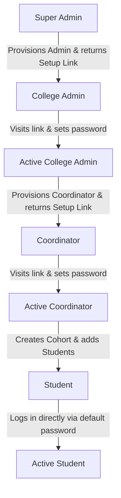

<div align="center">
  <h1>🎓 PlaceIQ</h1>
  <p><strong>A Next-Generation, Dual-Interface College Placement Management Platform</strong></p>
  <p>PlaceIQ is an enterprise-grade web application designed to streamline campus recruitments. It provides highly tailored interfaces for Placement Coordinators, College Admins, and Students, powered by a robust backend and role-based provisioning security.</p>
</div>

<hr/>

## ✨ Core Features

### 🏢 Platform & College Administration (Trading Terminal Aesthetic)
A dense, data-forward interface built for power users handling thousands of records.
- **Hierarchical Provisioning Security:** All registrations are locked down. Accounts are provisioned top-down via secure, token-based setup links.
- **Super Admin Panel:** Oversee all colleges, manage Pro/Free licenses, and provision new institution administrators.
- **College Admin Settings:** Control CGPA scale constraint (5 or 10-point scales) and define valid academic departments.
- **Coordinator Directory:** Provision placement coordinators and monitor setup/activation status in real-time.
- **At-Risk Analytics Engine:** Real-time flagging of students who are falling behind (e.g., low CGPA, active backlogs, 0 job applications) via MongoDB pipeline aggregations.
- **Multi-Channel Broadcasting:** Push critical job updates directly to students via Twilio WhatsApp API and Nodemailer emails.

### 👨‍🎓 Student Experience (Clean Room Aesthetic)
An ultra-minimalist, distraction-free environment for students to focus on their career.
- **Eligibility-Filtered Feed:** Students only see jobs they are strictly eligible for, eliminating application spam.
- **Hybrid ATS Scoring:** 
  - **Rule-Based Pre-Screening:** Instant, local resume matching scores (0-100%) calculated against job descriptions.
  - **On-Demand AI Review:** Students can expend a monthly quota (e.g., 3 per month) to get deep, OpenRouter-powered feedback on how to tailor their resume for a specific role.
- **Kanban Application Tracker:** A visual board to track applications across stages (Applied, Assessment, Interview, Offer, Rejected).

---

## 🔐 Hierarchical Onboarding Workflow

To maintain absolute data integrity and prevent unauthorized student registrations, PlaceIQ enforces a strict top-down account activation chain:



1. **Super Admin Setup:** Logs in via seeded credentials, registers a college, and provisions its **College Admin**. This creates a secure, token-based activation URL.
2. **College Admin Activation:** The College Admin visits their setup link, sets their password, and gains access to their configuration settings and Coordinator Directory.
3. **Coordinator Provisioning:** The College Admin provisions **Coordinators** for specific branches, generating setup activation links.
4. **Coordinator Activation:** The Coordinator visits their setup link, sets their password, and gains access to Cohort and Job Management.
5. **Student Provisioning:** The Coordinator creates a Cohort and registers **Students** (either individually or via bulk CSV upload). Students are immediately initialized with a standard default password (`student123`) and can log in directly.

---

## 🛠️ Technology Stack

**Frontend:**
- React 18, React Router DOM
- Tailwind CSS v3 (Customized `zinc` and `emerald` palette)
- Lucide Icons
- Typography: Inter (UI) & JetBrains Mono (Data)

**Backend:**
- Node.js & Express.js
- MongoDB & Mongoose
- JSON Web Tokens (JWT) for Role-Based Access Control (RBAC)
- Bcryptjs for password hashing

**Microservices & Integrations:**
- **ScrapeGraphAI (Python):** Intelligent web scraping of job descriptions using LLMs.
- **OpenRouter API:** Powers the on-demand student ATS deep-reviews.
- **Twilio API:** WhatsApp broadcasting for urgent announcements.
- **Nodemailer:** Automated daily cron-job emails.

---

## 🚀 Quick Start Guide

### 1. Prerequisites
- Node.js 18+ and npm 9+
- MongoDB (Atlas cluster or local instance)

### 2. Environment Configuration
Create a `.env` file in the `/server` directory:

```env
PORT=5001
NODE_ENV=development
MONGODB_URI=your_mongodb_connection_string
JWT_SECRET=your_jwt_signing_secret
JWT_EXPIRES_IN=7d

# Seed Script Credentials
SEED_ADMIN_EMAIL=admin@anurag.edu.in
SEED_ADMIN_PASSWORD=password123

# Optional: AI & Integrations
OPENROUTER_API_KEY=your_openrouter_key
TWILIO_SID=your_twilio_sid
TWILIO_AUTH=your_twilio_auth
TWILIO_WHATSAPP_FROM=+14155238886
EMAIL_USER=your_email@domain.com
EMAIL_PASS=your_app_password
```

Create a `.env` file in the `/client` directory:
```env
REACT_APP_API_URL=http://localhost:5001/api
```

### 3. Installation & Database Reset
```bash
# Install all root, client, and server dependencies
npm run install-all

# Reset database & seed the Super Admin
npm run seed
```

**Seeded Super Admin Credentials (Fresh Start):**
- **Email:** `admin@gmail.com`
- **Password:** `password123`

*(All subsequent admin, coordinator, and student accounts must be provisioned through the platform flow)*

### 4. Running the Application
To run the full stack concurrently:
```bash
npm run dev
```
- **Frontend App:** `http://localhost:3000`
- **Backend API:** `http://localhost:5001`

---

## 📂 Project Architecture

```text
placeiq/
├── client/                     # React Frontend
│   ├── src/
│   │   ├── api/                # Axios interceptor setups
│   │   ├── components/         # Divided into /shared, /coordinator, /student
│   │   ├── context/            # AuthContext (JWT handling)
│   │   ├── pages/              # SetupAccount.js, AdminApp.js, etc.
│   │   └── index.css           # Global Tailwind directives
│
├── server/                     # Express Backend
│   ├── config/                 # DB connection logic
│   ├── cron/                   # Automated Node-Cron jobs
│   ├── middleware/             # Auth & Role verification (RBAC)
│   ├── models/                 # Mongoose Schemas (User, Job, Batch, etc.)
│   ├── routes/                 # API endpoints (auth, admin, batches, etc.)
│   ├── scripts/                # Database seeders
│   └── services/               # External integrations (ATS, Scraper, Twilio, Nodemailer)
```

---

## 📄 License
Distributed under the MIT License. See `LICENSE` for more information.
