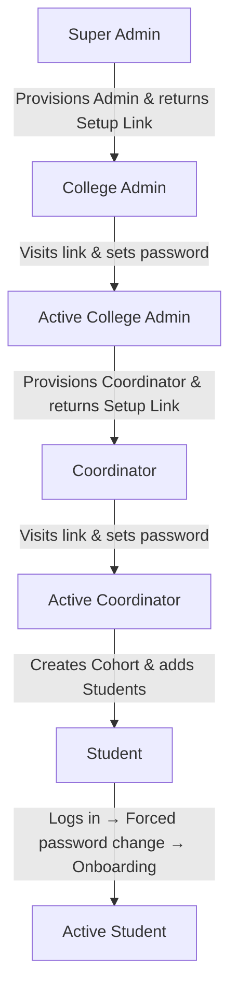

<div align="center">
  <h1>🎓 PlaceIQ</h1>
  <p><strong>A Next-Generation, Multi-Tenant College Placement Management Platform</strong></p>
  <p>PlaceIQ is an enterprise-grade, production-ready web application designed to streamline campus recruitments at scale. It provides highly tailored interfaces for Super Admins, College Admins, Placement Coordinators, and Students — powered by AI integrations, a robust security model, and real-world infrastructure.</p>

  
  
  
  
  
  
</div>

<hr/>

## ✨ Core Features

### 🏢 Platform & College Administration
A dense, data-forward "trading terminal" interface built for power users.
- **Hierarchical Provisioning Security:** All registrations are locked down. Accounts are provisioned top-down via secure, token-based setup links.
- **Super Admin Panel:** Oversee all colleges, manage Pro/Free licenses, configure AI review quotas, and provision institution administrators.
- **College Admin Settings:** Control CGPA scale constraint (5 or 10-point) and define valid academic departments.
- **Coordinator Directory:** Provision placement coordinators and monitor setup/activation status in real-time.
- **At-Risk Analytics Engine:** Real-time flagging of students falling behind (low CGPA, backlogs, zero applications) via MongoDB aggregation pipelines.
- **Multi-Channel Broadcasting:** Push critical job updates via Twilio WhatsApp API and Nodemailer emails.

### 👨‍🎓 Student Experience
An ultra-minimalist, distraction-free environment for students to focus on their career.
- **Eligibility-Filtered Feed:** Students only see jobs they are strictly eligible for, eliminating application spam.
- **Hybrid ATS Scoring:**
  - **Rule-Based Pre-Screening:** Instant resume matching (0-100%) with synonym-aware keyword analysis.
  - **On-Demand AI Review:** Monthly quota (configurable per college, default: 3) for OpenRouter-powered deep resume feedback.
- **Kanban Application Tracker:** Visual board tracking applications across stages (Applied → Assessment → Interview → Offer → Rejected).
- **Structured Interview Tracking:** Per-application interview rounds with scheduling, status, and feedback.
- **Offer Verification Pipeline:** Students upload offer letters → Coordinators verify/reject.

### 🔐 Security & Hardening
- **Helmet.js** security headers (CSP, HSTS, X-Frame-Options)
- **Rate limiting** on all authentication endpoints (20 req / 15 min)
- **CORS** restricted to configured client origin
- **Cloudinary** cloud storage (no local filesystem exposure)
- **Server-side onboarding enforcement** via middleware
- **Optimistic concurrency control** on application stage transitions
- **Audit logging** on all mutations with 90-day TTL
- **Forced password change** on first student login

---

## 🔐 Hierarchical Onboarding Workflow



1. **Super Admin** logs in via seeded credentials, provisions colleges and their admins.
2. **College Admin** activates via setup link, configures departments and CGPA scale.
3. **Coordinator** activates via setup link, manages jobs, batches, and students.
4. **Student** logs in with default credentials → forced to change password → completes profile onboarding → gains full access.

---

## 🛠️ Technology Stack

| Layer | Technologies |
|---|---|
| **Frontend** | React 18, React Router v6, Tailwind CSS v3, Lucide Icons, Axios, react-hot-toast |
| **Backend** | Node.js 18+, Express.js, MongoDB 6+, Mongoose, JWT, bcryptjs, Helmet, express-rate-limit |
| **AI & Integrations** | Python/FastAPI Scraper (Playwright + Jina AI Reader + Multi-Provider LLM Router), OpenRouter, Groq, Google Gemini, Twilio API, Nodemailer, Cloudinary |
| **DevOps** | Docker + docker-compose, GitHub Actions CI, Jest + Supertest, ESLint + Prettier |

---

## 🚀 Quick Start Guide

### Prerequisites
- Node.js 18+ and npm 9+
- MongoDB (Atlas cluster or local instance)

### Option A: Docker (Recommended)
```bash
# Clone and start all services
docker-compose up --build
```
This launches MongoDB, the Node.js API server, and the Python scraper service.

### Option B: Manual Setup

#### 1. Environment Configuration
Create a `.env` file in the `/server` directory:
```env
PORT=5001
NODE_ENV=development
MONGODB_URI=your_mongodb_connection_string
JWT_SECRET=your_strong_random_secret_min_32_chars
JWT_EXPIRES_IN=7d
CLIENT_URL=http://localhost:3000

# Seed Script Credentials
SEED_ADMIN_EMAIL=admin@gmail.com
SEED_ADMIN_PASSWORD=password123

# Cloudinary (required for file uploads)
CLOUDINARY_CLOUD_NAME=your_cloud_name
CLOUDINARY_API_KEY=your_api_key
CLOUDINARY_API_SECRET=your_api_secret

# Optional: AI & Integrations
OPENROUTER_API_KEY=your_openrouter_key
GROQ_API_KEY=your_groq_key
GEMINI_API_KEY=your_gemini_key
TWILIO_SID=your_twilio_sid
TWILIO_AUTH=your_twilio_auth
TWILIO_WHATSAPP_FROM=+14155238886
EMAIL_USER=your_email@domain.com
EMAIL_PASS=your_app_password
```

Create a `.env` file in the `/client` directory:
```env
REACT_APP_API_URL=http://localhost:5001/api
```

#### 2. Installation & Database Seed
```bash
# Install all dependencies (root, client, server)
npm run install-all

# Reset database & seed the Super Admin
npm run seed
```

#### 3. Running the Application
```bash
npm run dev
```
- **Frontend:** `http://localhost:3000`
- **Backend API:** `http://localhost:5001`

### Seeded Super Admin Credentials
- **Email:** `admin@gmail.com`
- **Password:** `password123`

*(All subsequent accounts must be provisioned through the platform's hierarchical flow)*

---

## 📂 Project Architecture

```text
placeiq/
├── client/                         # React Frontend
│   ├── src/
│   │   ├── api/                    # Axios interceptor (401 auto-logout)
│   │   ├── components/
│   │   │   ├── shared/             # ErrorBoundary, Sidebar, Pagination, Spinner, etc.
│   │   │   ├── coordinator/        # JobsManager, Batches, CompaniesManager, etc.
│   │   │   ├── student/            # Feed, Tracker, Onboarding, Profile, etc.
│   │   │   └── admin/              # CollegesTable, CoordinatorDirectory, Settings, etc.
│   │   ├── context/                # AuthContext, ThemeContext
│   │   └── pages/                  # Login, Register, CoordinatorApp, AdminApp, etc.
│
├── server/                         # Express Backend
│   ├── config/                     # DB connection, constants (roles, file types)
│   ├── cron/                       # Scheduled jobs (deadline, urgency, autoClose, scrape)
│   ├── middleware/                  # auth, requireRole, paginate, cache, onboarded, auditLogger
│   ├── models/                     # 10 Mongoose schemas (indexed)
│   ├── routes/                     # 11 route files, 65 endpoints
│   ├── services/                   # ATS, scraper, email, broadcast, Cloudinary storage
│   ├── scripts/                    # seedAdmin.js, dropDb.js (with safeguards)
│   └── __tests__/                  # Jest test suites (22 tests)
│
├── scraper-service/                # Python FastAPI Microservice
│   ├── main.py                     # FastAPI server with /health endpoint
│   ├── scraper.py                  # Custom Playwright + Jina AI + Multi-Provider LLM scraper
│   ├── build.sh                    # Render deployment script
│   └── Dockerfile
│
├── docker-compose.yml              # 3-service orchestration
├── .github/workflows/ci.yml        # Automated CI pipeline
├── .eslintrc.js / .prettierrc      # Code quality configs
└── LICENSE                         # MIT
```

---

## 🧪 Testing

```bash
cd server && npm test
```

| Suite | Tests | Coverage |
|---|---|---|
| Auth routes | 5 | Login, setup, password flows |
| Applications routes | 4 | Apply, stage transitions, concurrency |
| Auth middleware | 4 | JWT verification, role guards |
| Storage service | 3 | Cloudinary upload, file validation |
| ATS service | 3 | Scoring, synonym matching |
| Role middleware | 3 | RBAC enforcement |
| **Total** | **22** | All passing ✅ |

---

## 📖 Documentation

See [DOCUMENTATION.md](./DOCUMENTATION.md) for:
- Complete API reference (65 endpoints)
- Database schema details
- Middleware architecture
- Security measures
- Deployment guide

---

## 📄 License
Distributed under the MIT License. See `LICENSE` for more information.
